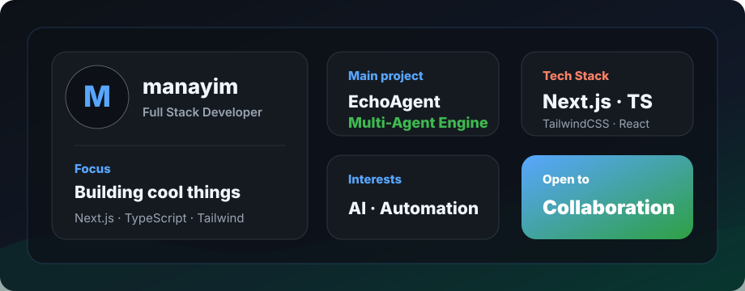

  

  

**🚀 Full Stack Developer** | **🤖 AI Enthusiast** | **🛠️ 开源工具作者**

> 正在构建一些有趣的小玩意，用代码解决问题，用技术创造价值 ✨

  
  
  

---

### 🎯 关于我

- 🔭 正在研究 **AI Agent** 和 **Multi-Agent** 系统
- 🌱 最近在学习 **LLM 应用开发** 和 **Prompt Engineering**
- 💡 喜欢把复杂的问题简化，用代码创造实用的工具
- ⚡ 偶尔写技术博客，分享学习心得

---

### 🛠 技术栈

---

### 🏆 项目展示

| 项目 | 描述 | 技术 |
|------|------|------|
| [**EchoAgent**](https://github.com/manayim/EchoAgent) | Multi-Agent 自动化引擎 | Next.js, Claude 3.5 |
| [**ai-image-studio**](https://github.com/manayim/ai-image-studio) | 🎨 AI 图像生成平台 | Next.js, OpenAI |
| [**xhs_blueprint_picker**](https://github.com/manayim/xhs_blueprint_picker) | 小红书选品爬虫工具 | Python, Playwright |

---

### 📬 找到我

---

**如果我的项目对你有帮助，欢迎点个 ⭐ Star 支持一下！**

